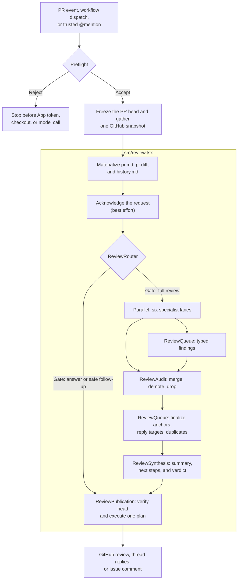

# Singular Code Review

Singular Code Review is the pull-request reviewer we run on our own repositories at [Singular](https://github.com/we-are-singular). It reads the code around a diff, gives the change to six focused reviewers, audits their findings, and publishes one GitHub review.

The reviewer is written with [Agent Markup Language (AML)](https://agent-markup-language.com/). The review tree is declarative; TypeScript owns the GitHub snapshot, finding queue, validation, verdict, and publication.

> [!IMPORTANT]
>
> Singular operates the deployed GitHub App privately. Its private key is not shared. To run this reviewer outside Singular, fork the repository, create your own GitHub App, publish your own image, and point your repositories at your fork.

## Why we built it

At Singular, this is our alternative to adding another paid code-review service or coding assistant to every repository. Reviews run on our own hardware and GitHub runners, and we can move between free and inexpensive models without changing the review contract. It has already saved us thousands of euros in reviewer costs.

We are building the engine in public so anyone can inspect the review policy, model boundaries, GitHub safety checks, and evals used to change them. The eventual goal is a hosted product where someone installs an App, chooses a repository, and does not operate the reviewer themselves. The control plane is still future work; its scope lives in [Future Work](FUTURE.md).

## What a review produces

A full run publishes:

- specific problems as comments on changed lines;
- replies beside existing review threads when the author asked there;
- a short top-level summary that does not repeat every inline comment;
- one application-derived verdict: `⛔ Block`, `⚠️ Request changes`, or `✅ LGTM`.

Follow-up events do not always need another full review. The gate can answer a direct question or return a quick `✅ LGTM` when the current head was already reviewed and the new change is safely contained.

## How a review runs



The `src/review.tsx` section maps directly to the component tree in [src/review.tsx](src/review.tsx):

```tsx
<Workspace>
  <ReviewContextFiles />
  <ReviewAcknowledgement />
  <ReviewRouter>
    <ReviewSynthesis>
      <ReviewAudit>
        <Parallel>
          <IntentContractLane />
          <StandardsArchitectureLane />
          <CodePathBugHunterLane />
          <CorrectnessRiskTestingLane />
          <DocumentationCommentaryLane />
          <MaintainabilityEleganceLane />
        </Parallel>
      </ReviewAudit>
    </ReviewSynthesis>
  </ReviewRouter>
  <ReviewPublication />
</Workspace>
```

AML reads the model tree from the leaves back to the trunk. The nesting defines the review and publication boundaries:

- `<Parallel>` makes the six investigations concurrent and fails the review if any lane fails. Native fragments keep each authored heading and lane in one branch; every lane records typed findings through Tools and returns a short terminal handoff.
- `<ReviewAudit>` explicitly resolves all six children before it freezes the staged queue. It skips the audit Agent when no finding exists and otherwise gives that Agent the ordered lane handoffs plus only the merge, demote, and drop Tools.
- Finding anchors and reply targets are validated when lane Tools add them. `<ReviewSynthesis>` finalizes duplicate and prior-comment handling directly from the queue, runs the typed synthesis Agent, derives the verdict, and returns the composed JSX body to its parent.
- `<ReviewRouter>` is the intentional conditional boundary. It obtains the deterministic or typed gate decision, evaluates only the selected route, and completes one routed body through the request Context API.
- AML evaluates `<ReviewPublication>` next in authored order. Publication reads the completed route, derives the publication draft from it and the queue, verifies that GitHub still points to the reviewed commit, and executes one deterministic write plan.

The shared review Context carries request-scoped dependencies plus small APIs for the typed queue, completed routing handoff, and final publication outcome. Its top-level value is not reactive state: components share the same request binding, and mutable workflow transitions remain behind the owning APIs. Audited and validated snapshots are derived from the queue where they are consumed instead of being copied into phase-owned Context fields.

The [AML source is on GitHub](https://github.com/we-are-singular/aml). Its `Agent`, `Parallel`, `Skill`, `Tool`, and `Workspace` components describe the model-facing work without taking ownership of trusted application state.

### The six lanes

| Lane | Question it owns |
| --- | --- |
| Intent and contract | Does the patch satisfy the stated requirement and the strongest active repository contract? |
| Standards and architecture | Does it follow package ownership, canonical sources, repository rules, and established design? |
| Code-path bugs | Can a changed value or state transition break a real caller or consumer? |
| Correctness, risk, and testing | Are security, authorization, data integrity, compatibility, concurrency, rollout, performance, and tests adequate? |
| Documentation and commentary | Do active docs, examples, release guidance, and non-obvious comments still tell the truth? |
| Maintainability and elegance | Is the change locally clear, well placed, and free of needless concepts or indirection? |

Each lane can read the checkout and the same frozen PR evidence. Native shell and network access are disabled. Context7 and narrow read-only GitHub tools are available when the change depends on external documentation or linked GitHub evidence. Findings reach the author only through typed review tools.

### Model judgment and application authority

| Model work                          | Application work                              |
| ----------------------------------- | --------------------------------------------- |
| Classify an ambiguous follow-up     | Reject untrusted triggers and fork heads      |
| Investigate the six review concerns | Freeze one PR head and snapshot               |
| Audit staged findings               | Own the typed finding queue                   |
| Write the short review summary      | Validate anchors, replies, and duplicates     |
| Suggest useful next steps           | Derive the verdict and GitHub payload         |
|                                     | Verify the head and execute idempotent writes |

Models investigate and write. They do not decide which commit was reviewed, whether a comment can be posted, what verdict a severity produces, or whether a GitHub mutation should be retried.

## Run it

### Use it locally before pushing

You do not need to deploy the GitHub App to use the review policy while you work. The [singular-code-review skill](https://www.skills.sh/we-are-singular/skills/singular-code-review) packages the same review guidelines and checks into a `SKILL.md`, so a skill-compatible coding agent can inspect the local diff before it reaches the repository.

```bash
npx skills add https://github.com/we-are-singular/skills --skill singular-code-review
```

Use the skill "at home" to catch problems before pushing; the GitHub App handles the full pull-request review and publication pipeline.

### Inside Singular

Repositories that can use the Singular-owned App need the App installed plus these Actions secrets:

- `SINGULAR_CODE_REVIEW_PRIVATE_KEY` for the App;
- `OPENCODE_API_KEY` for the production model;
- `CONTEXT7_API_KEY` when higher Context7 limits are needed.

Copy [examples/singular-code-review.yml](examples/singular-code-review.yml) into the target repository under `.github/workflows/`. The workflow handles opened PRs, ready-for-review drafts, new heads, manual dispatches, and trusted `@singular-code-review` comments.

### Fork it and make it yours

1. Fork this repository.
2. Create a GitHub App with `Contents: read`, `Issues: write`, and `Pull requests: write`, then install it on the repositories you want reviewed.
3. Update the App client ID and container image in [.github/workflows/review.yml](.github/workflows/review.yml). The image should point at your fork's GHCR package.
4. Update the reusable-workflow owner in [examples/singular-code-review.yml](examples/singular-code-review.yml) from `we-are-singular` to your GitHub owner.
5. If you rename the bot, change the mention and default bot login in [src/services/review-evidence.ts](src/services/review-evidence.ts), then update the example workflow trigger.
6. Push to your fork's `main` branch to publish `ghcr.io/YOUR_OWNER/YOUR_REPOSITORY:latest`.
7. Store your App private key and model credentials as repository or organization secrets in each consuming repository, then copy your edited trigger workflow there.

The consuming repository receives a short-lived installation token during each run. It does not receive a long-lived GitHub token. You own the App, private key, image, model account, runner capacity, and any changes to the review policy.

## Configuration

The reusable workflow accepts:

| Input                | Default         | Purpose                                              |
| -------------------- | --------------- | ---------------------------------------------------- |
| `pr_number`          | required        | Pull request to review                               |
| `trigger_comment_id` | empty           | Trusted comment that requested the run               |
| `runner`             | `ubuntu-latest` | GitHub Actions runner label                          |
| `npm_install`        | `false`         | Install target-repository dependencies before review |

Set the repository variable `REVIEW_MODEL` to override `opencode-go/deepseek-v4-flash`. The older `OPENCODE_MODEL` variable remains compatible.

Dependency installation is opt-in because package scripts run with the review job's credentials available. Enable it only for trusted repositories where installed dependencies materially improve the review.

Start a PR title with `[skip]`, or put `@singular-code-review skip` on its own line in the PR body, to stop before App-token creation, checkout, dependency installation, and model work.

## Trust and failure boundaries

- The caller and reusable workflow reject fork pull requests before trusted credentials reach PR code.
- Mention triggers accept repository owners, members, collaborators, or the PR author and reject bot comments.
- The workflow uses `pull_request` and `issue_comment`, never `pull_request_target`.
- Every model phase sees the same cached GitHub snapshot and filtered diff.
- A failed lane, audit, queue finalization, synthesis, or model run leaves no publishable review.
- The CLI is dry-run by default; live GitHub mutations require `--publish`.
- Publication checks the PR head again and does not replay an ambiguous failed mutation.

Pull request text, comments, diffs, repository files, and linked GitHub content are untrusted evidence. They cannot grant tools or change the review contract.

## Calibration snapshots

We maintain an eval framework that runs the reviewer against a corpus of private Singular pull requests and public pull requests from well-known open-source libraries. Each run captures a review without publishing it and uses an LLM judge to score the result.

It is not a foolproof benchmark. The corpus reflects the code and review problems we care about, and LLM-as-judge has its own blind spots. It gives us a useful ruler for checking whether changes to the reviewer improve review quality without making reviews slower or more expensive.

Time and reviewer cost are averages per review; cost excludes judge inference. Each row is that model's latest completed snapshot, not a same-revision model comparison.

| Model                | Score |    Time |              Cost |
| -------------------- | ----: | ------: | ----------------: |
| DeepSeek V4 Flash    |  87.6 |  5m 45s | $0.0129–$0.0258\* |
| GLM 5.3 Flash        |  87.8 |  5m 43s |           $0.0108 |
| MiMo V2.5            |  86.0 |  7m 32s |           $0.0128 |
| HY3                  |  83.0 |  3m 23s |           $0.0307 |
| Qwen 3.7 Max         |  83.0 | 18m 41s |           $0.9504 |
| GPT-5.6 Luna `xhigh` |  76.5 | 17m 14s |           $0.0838 |
| MiniMax M3           |  74.7 |  9m 42s |           $0.6012 |

\* DeepSeek V4 Flash uses separate [off-peak and weekday peak prices](https://opencode.ai/docs/go/#usage-limits). The range applies both prices to this snapshot's measured token usage; actual cost also varies with review content, cache behavior, and provider pricing changes.

The DeepSeek row was refreshed on 2026-08-31 after separating conditional routing into `<ReviewRouter>`, keeping publication as the next authored component, and allowing review handoffs to resolve natively from the specialist leaves through audit and synthesis. On the same pinned, history-blind ten-PR corpus and unchanged rubric, all ten reviews completed and the score moved from 88.0 to 87.6 while mean reviewer time moved from 3m 49s to 5m 45s. The reviewer used 79 model completions instead of 80; total reviewer token volume increased 4.8%, while the combined audit and synthesis volume remained effectively flat. This is one directly comparable run, not a repeated-run confidence interval, and observed latency varies with provider load.

See [eval/README.md](eval/README.md) for the capture, judgment, reporting, comparison, and private-corpus rules.

## Local development

Requirements:

- Node.js 26 or newer;
- Docker;
- an authenticated GitHub CLI or `GH_TOKEN`/`GITHUB_TOKEN` for eval inputs;
- credentials for any model used by a real review.

```bash
npm ci
npm test
npm run lint
npm run format:check
docker build -t singular-code-review:local .
```

Run one real pull request through the production review boundary without publishing to GitHub:

```bash
OPENCODE_API_KEY=... npm run eval -- \
  --no-config-input \
  --pr trpc/trpc/7262 \
  --model opencode-go/deepseek-v4-flash \
  --out eval/runs/smoke
```

The evaluator prepares the exact checkout outside the image, mounts it into the review workspace, and invokes `review_runner` without `--publish`.

## Images and rollback

Successful pushes to `main` publish:

```text
ghcr.io/we-are-singular/singular-code-review-agent:latest
ghcr.io/we-are-singular/singular-code-review-agent:sha-<commit>
```

Version tags publish matching image tags. The final pre-[AML](https://agent-markup-language.com/) reviewer is frozen as the manually published `legacy` tag with a matching [.github/workflows/review-legacy.yml](.github/workflows/review-legacy.yml). Normal pushes do not update it. It is a rollback path for Singular's existing deployment and does not receive new review features.

## Project documents

- [PRD.md](PRD.md) defines the review engine's product and safety contract.
- [eval/README.md](eval/README.md) documents repeatable model and reviewer evaluation.
- [FUTURE.md](FUTURE.md) tracks the managed service and reviewer work that remains.
