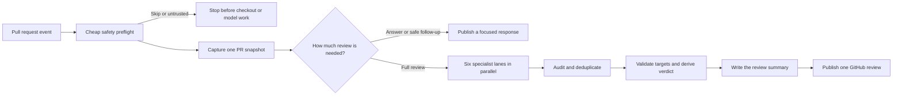

# Singular Code Review Agent

Singular Code Review Agent reviews pull requests from GitHub Actions. It gives each change to six focused reviewers, turns their evidence into one calibrated review, and publishes through a GitHub App.

The reviewer is implemented as an Agent Markup Language (AML) workflow. AML makes the review sequence, parallel work, prompt policy, tools, and model boundaries explicit; deterministic TypeScript owns the GitHub snapshot, validation, verdict, and publication.

This repository publishes the reusable workflow and container image used by Singular repositories. It is open source infrastructure, not the hosted subscription service described in [Future Work](FUTURE.md).

## What an author sees

A completed run produces one of three useful outcomes:

- a direct answer when the author asked a conversational question;
- a quick `✅ LGTM` when the current head has already been reviewed or a follow-up is safely contained;
- a full review with a concise summary, anchored findings, any direct thread replies, and an application-derived verdict.

Specific problems stay in inline comments. The top-level summary explains the state of the pull request without duplicating every finding.

## How a review works



### Start with the cheapest safe decision

The reusable workflow first rejects unsupported fork heads, ignored events, untrusted mentions, bot requests, and explicit skip instructions. This happens before the GitHub App token is created, the repository is checked out, dependencies are installed, or model inference starts.

For an accepted run, the application checks out the exact pull request head and captures one API-backed snapshot of its metadata, commits, filtered diff, discussion, prior reviews, threads, and timeline. Every later phase works from that same evidence, and publication stops if the head changes.

The gate then decides whether the event needs a full review. Deterministic rules handle obvious cases; a small Agent decision is used only when the delta or conversation is ambiguous. An explicit review or re-review request always reaches the full review.

### Give each reviewer one job

Six AML `Agent` components investigate the pull request in parallel. Each can read the checkout and shared review evidence, but each owns a different question:

- Intent and contract: does the patch satisfy the stated requirement and the strongest active repository contract?
- Standards and architecture: does it respect package ownership, canonical sources, repository rules, and established design?
- Code-path bugs: can changed values or state transitions produce a concrete runtime failure in a current caller or consumer?
- Correctness, risk, and testing: are security, authorization, data integrity, compatibility, concurrency, rollout, performance, and behavioral proof adequate?
- Documentation and commentary: do active docs, examples, release guidance, and non-obvious code comments still tell the truth?
- Maintainability and elegance: is the change locally simple, well named, properly placed, typed clearly, and free of needless concepts, indirection, redundancy, or monolithic growth?

Each lane receives the same evidence-first review policy plus its own focused assignment. The shared policy explains the full review pipeline, severity contract, publication rules, and the lane's limited ownership. In AML, `Skill` inlines this policy into the Agent prompt; it does not install a global capability or make the policy available to other phases.

Separately, the image installs backend and frontend architecture skills as optional provider-native capabilities that OpenCode can discover when the repository makes them relevant.

Lanes have read-only filesystem access with native shell and network access disabled. Context7 is available for material external-library questions, and narrow read-only GitHub tools can inspect a pull request, issue, or commit explicitly referenced by the active change. Finding tools are the only path to author-visible feedback.

### Turn observations into one review

A lane stages a complete inline comment, a reply to an existing review thread, or the exceptional anchorless critical blocker. Its terminal prose is an internal handoff and can never become a finding by accident.

Audit sees the staged queue rather than performing another review. It can merge duplicates, lower severity, or drop weak, resolved, speculative, disproportionate, or redundant findings. It cannot invent findings, promote severity, rewrite author text, change evidence, or move anchors, and it cannot retain more than 24 findings.

Deterministic validation then checks changed-line anchors, reply targets, duplicate comments, and unresolved previous bot threads. The application, not a model, derives the verdict:

| Retained result | Meaning | Verdict |
| --- | --- | --- |
| Review-level blocker or `critical` finding | The pull request is fundamentally unsafe to land | `⛔ Block` |
| Any `high`, `low`, or `question` finding | Author action or a required decision remains before merge | `⚠️ Request changes` |
| Only `nit` findings, or no findings | The pull request may safely merge unchanged | `✅ LGTM` |

The severity contract is based on merge action:

- `critical` is reserved for destructive, exploitable, outage-level, or otherwise unlandable changes.
- `high` is a clear material regression, authorization failure, contract break, or rollout risk that must be fixed.
- `low` is a concrete defect, contract problem, or material present structural cost that should be fixed before merge unless a human accepts it with a reason.
- `question` is a specific unresolved decision whose answer changes merge readiness.
- `nit` is a useful local cleanup that is explicitly safe to leave unchanged.

Finally, a synthesis Agent writes a short summary from the validated result. It has no finding tools and cannot change the verdict. Deterministic application code constructs the final payload and publishes one batched GitHub review plus any prepared thread replies.

## Why AML is used

AML owns the model-facing control flow:

- `Workspace` scopes one review run and its materialized evidence.
- `Agent` gives each phase a clear role, permissions, and prompt boundary.
- `Parallel` makes the six independent investigations explicit.
- `Skill` centralizes stable phase policy without hiding runtime inputs in Markdown templates.
- `Tool` exposes only the capabilities a phase is allowed to use.

Application code owns the parts that must not depend on model judgment:

- gathering and caching the pull request snapshot;
- binding the checkout and publication to one commit;
- storing typed findings and phase results;
- validating line anchors, reply targets, and duplicate feedback;
- deriving the verdict;
- constructing GitHub payloads and recording mutations.

This division lets Agents investigate and write while keeping review state, merge consequences, and external side effects predictable.

## Publication and failure handling

GitHub reads are gathered by the application before specialist work begins. GitHub writes pass through an idempotent action ledger: a confirmed action is not repeated, and an ambiguous failed mutation is not replayed.

The CLI is dry-run by default and requires `--publish` for live GitHub mutations. Immediately before publication, the application verifies that the pull request still points to the reviewed head and submits the batched review against that exact commit.

Production uses the OpenCode ACP supplied by the pinned AML Agent Sandbox with `opencode-go/deepseek-v4-flash`. Codex ACP with `gpt-5.6-luna` remains available for deliberate evaluation rather than normal production runs.

## Model comparison

The current AML workflow was run once per model across the same fixed, history-blind ten-PR calibration corpus. Both runs used the same reviewer revision and judge. Only model-level aggregates are published; source identifiers, review text, captures, and generated reports remain local.

| Model             | Completed | Judge score | Mean review time | Reported reviewer cost/run |
| ----------------- | --------: | ----------: | ---------------: | -------------------------: |
| DeepSeek V4 Flash |     10/10 |    86.9/100 |           5m 31s |                    $0.0096 |
| GLM 5.3 Flash     |     10/10 |    87.8/100 |           5m 43s |                    $0.0108 |

Provider-reported reviewer cost excludes judge inference. This is a calibration snapshot, not a general model ranking; repository mix, prompts, provider revisions, and the judge can change the result.

## Install

1. Install the Singular Code Review GitHub App on the target repository.
2. Add `SINGULAR_CODE_REVIEW_PRIVATE_KEY` and `OPENCODE_API_KEY` as repository or organization Actions secrets. `CONTEXT7_API_KEY` is optional.
3. Copy the [example trigger workflow](examples/singular-code-review.yml) to the target repository's `.github/workflows/` directory.
4. Open a same-repository pull request, mark a draft ready, push a new head, dispatch the workflow manually, or have a trusted collaborator comment `@singular-code-review`.

The example listens to `pull_request` and `issue_comment`. Do not replace `pull_request` with `pull_request_target`, which would place trusted credentials beside untrusted fork code.

### Existing installations

No migration is required for repositories already calling the reusable workflow at `@main`. The public inputs, secrets, GitHub App, and caller workflow remain compatible. After a successful push to `main` publishes the new `latest` image, the next review run automatically uses the AML implementation.

Existing `OPENCODE_MODEL` repository variables remain supported. `REVIEW_MODEL` is the preferred variable and takes precedence when both are set.

### Legacy rollback

The final pre-AML image is frozen as `ghcr.io/we-are-singular/singular-code-review-agent:legacy`. Because that image exposes a different command surface, it has a matching frozen reusable workflow.

To opt into the legacy reviewer, change only the reusable workflow reference:

```yaml
uses: we-are-singular/singular-code-review-agent/.github/workflows/review-legacy.yml@main
```

Change it back to `review.yml@main` to return to AML. The legacy path is a rollback aid and does not receive new review features or fixes.

## Configuration

The reusable workflow accepts:

- `pr_number`: required pull request number;
- `trigger_comment_id`: optional comment that requested the review;
- `runner`: optional GitHub Actions runner label;
- `npm_install`: optional dependency installation before review, disabled by default.

Enable `npm_install` only when repository dependencies materially improve the review. Package installation scripts execute with the review job's credentials available.

Set the repository variable `REVIEW_MODEL` to override the production model. Start a pull request title with `[skip]` or add `@singular-code-review skip` to its body to stop before App-token creation, checkout, and model work.

## Security boundary

Mention triggers accept repository owners, members, collaborators, or the pull request author and ignore bot comments. Fork pull requests are rejected before secrets, checkout, dependency installation, and inference.

Each accepted run mints a short-lived GitHub App installation token for checkout, API reads, acknowledgements, replies, and review submission. Investigative Agents cannot use native shell or network access; external documentation, linked GitHub evidence, and review staging are available only through declared AML tools.

Pull request text, comments, diffs, repository files, and linked GitHub content are treated as untrusted evidence. They cannot grant tools, change permissions, or override the review contract.

## Local development

```bash
npm ci
npm test
npm run lint
npm run format:check
docker build -t singular-code-review:local .
```

Run one real pull request through the production review boundary without publishing to GitHub:

```bash
OPENCODE_API_KEY=... npm run eval -- --no-config-input --pr trpc/trpc/7262 --model opencode-go/deepseek-v4-flash --out eval/runs/smoke
```

The evaluator verifies the requested revision, prepares the checkout outside the image, mounts it at the review workspace, and invokes the same production runner without `--publish`. See the [evaluation guide](eval/README.md) for scored runs, provider comparisons, caching, and reports.

## Images

Successful pushes to `main` publish:

```text
ghcr.io/we-are-singular/singular-code-review-agent:latest
ghcr.io/we-are-singular/singular-code-review-agent:sha-<commit>
```

Version tags publish matching image tags. The separate `legacy` tag remains pinned to the final pre-AML image.
